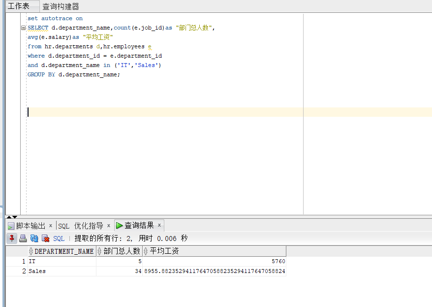
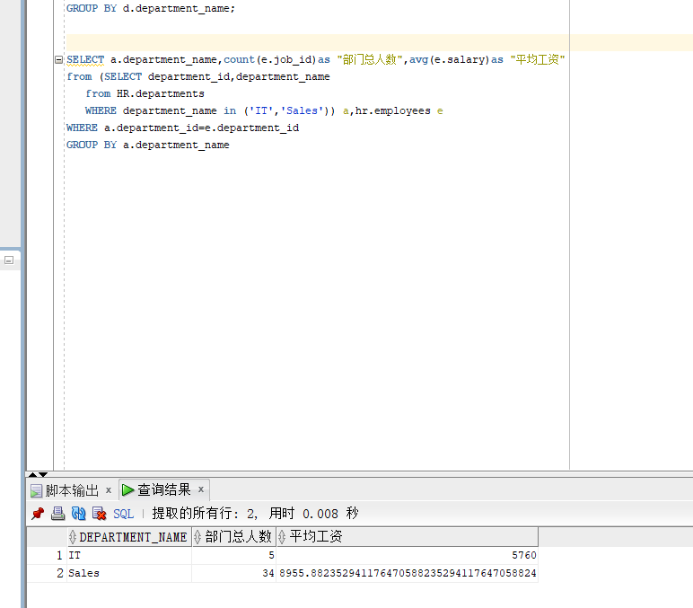
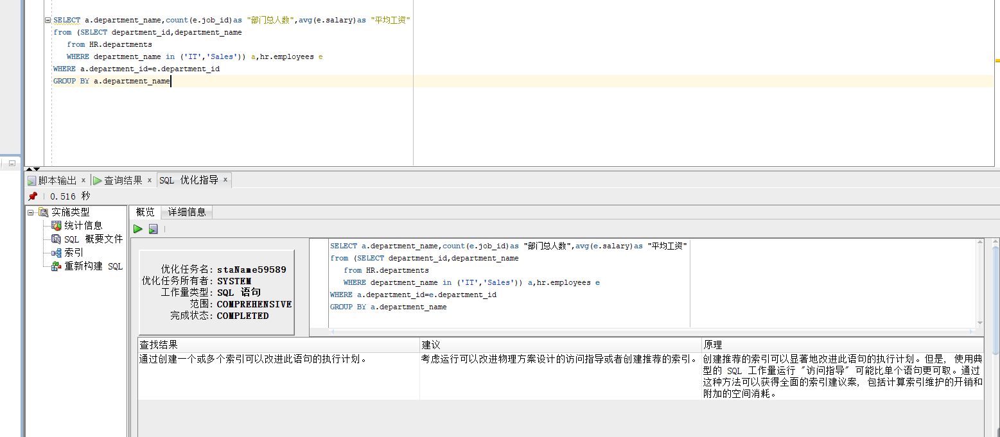

# 实验一：SQL语句的执行计划分析与优化指导
## 实验目的：
分析SQL执行计划，执行SQL语句的优化指导。理解分析SQL语句的执行计划的重要作用。
## 实验内容：
·对Oracle12c中的HR人力资源管理系统中的表进行查询与分析。
 ·首先运行和分析教材中的样例：本训练任务目的是查询两个部门('IT'和'Sales')的部门总人数和平均工资，以下两个查询的结果是一样的。但效率不相同。
· 设计自己的查询语句，并作相应的分析，查询语句不能太简单。
#### 样例查询语句：
查询一：
set autotrace on
SELECT d.department_name,count(e.job_id)as "部门总人数",
avg(e.salary)as "平均工资"
from hr.departments d,hr.employees e
where d.department_id = e.department_id
and d.department_name in ('IT','Sales')
GROUP BY d.department_name;

查询二：
set autotrace on
SELECT d.department_name,count(e.job_id)as "部门总人数",
avg(e.salary)as "平均工资"
FROM hr.departments d,hr.employees e
WHERE d.department_id = e.department_id
GROUP BY d.department_name
HAVING d.department_name in ('IT','Sales');

#### 案例结果截图：

#### 样例查询语句分析：
我认为查询一的查询语句最优，因为第一个查询语句是在最后执行group语句，而第二个查询先执行group后再执行having语句，效率就会变得很慢。通过sqldeveloper的优化指导工具，给出的优化建议是考虑运行可以改进物理方案设计的访问指导或者创建推荐的索引。

#### 设计查询语句：
SELECT a.department_name,count(e.job_id)as "部门总人数",avg(e.salary)as "平均工资"
from (SELECT department_id,department_name
   from HR.departments
   WHERE department_name in ('IT','Sales')) a,hr.employees e
WHERE a.department_id=e.department_id
GROUP BY a.department_name
#### 设计查询语句分析：
根据样例查询一语句的查询规律，按照我自己的理解，仿造样例一写了查询语句，我分别采用两个for查询和两个where查询，最后执行再group语句，其查询内容不变，发现最后查询的结果一致,但是相较于查询一的执行效率慢了一点，给出的优化建议是可以改进物理方案设计的访问指导或者创建推荐的索引。
#### 结果截图：

## 实验总结
本次实验让我学习到了看似大部分相同的查询语句，其实小小细节的不同就让查询的效率大不一样。就如本次实验的查询语句一样，虽然查询的结果都是一样的，但是第一种查询语句是最后才执行group语句，就比第二种查询方法的查询效率高了很多。本次实验还用到了sqldeveloper优化工具，以前没使用过，但是通过这次实验让我体会到了优化工具的好处，受益匪浅。

https://github.com/zhang-stafen/oracle/tree/master/test1
