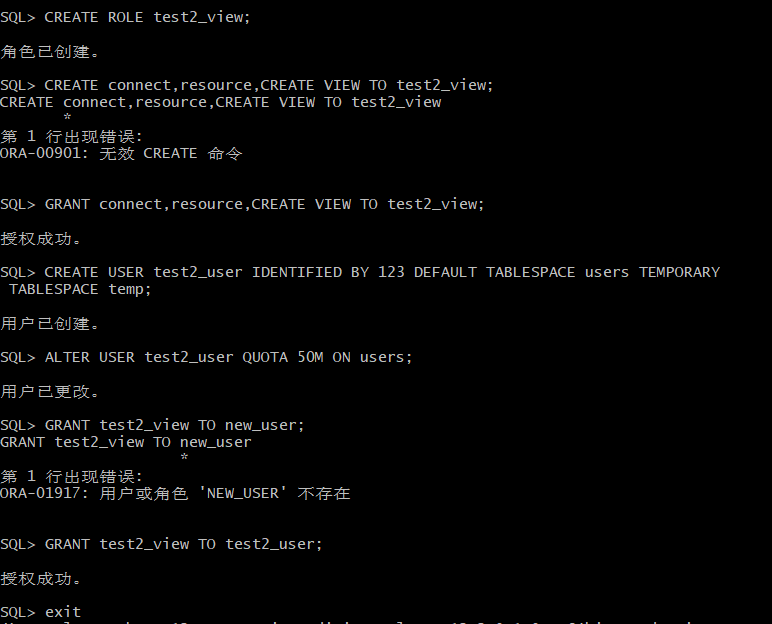
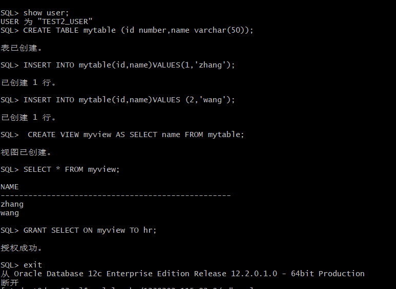
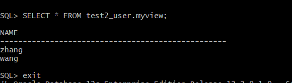
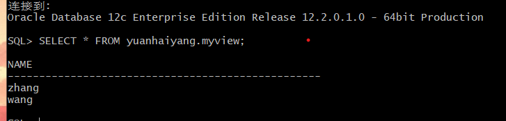
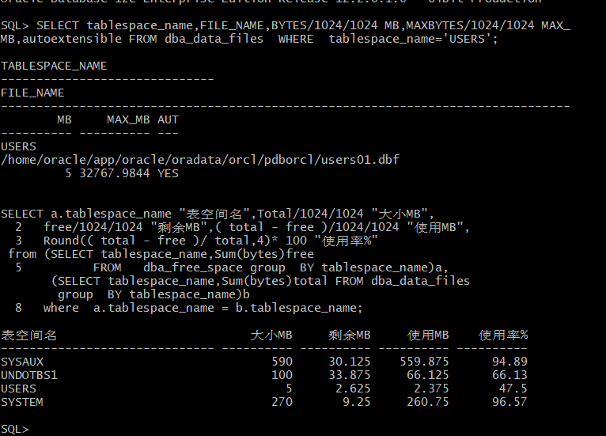

# 实验二：用户及权限管理

## 实验目的：
掌握用户管理、角色管理、权根维护与分配的能力，掌握用户之间共享对象的操作技能。

## 实验内容：
Oracle有一个开发者角色resource，可以创建表、过程、触发器等对象，但是不能创建视图。本训练要求：
·在pdborcl插接式数据中创建一个新的本地角色test_view，该角色包含connect和resource角色，同时也包含CREATE VIEW权限，这样任何拥有test_view的用户就同时拥有这三种权限。
·创建角色之后，再创建用户test2_user，给用户分配表空间，设置限额为50M，授予test2_view角色。
·最后测试：用新用户test2_user连接数据库、创建表，插入数据，创建视图，查询表和视图的数据。

#### 实验步骤：
一、以system登录到pdborcl，创建角色test2_view和用户test2_user，并授权和分配空间：

二、：新用户test2_user连接到pdborcl，创建表mytable和视图myview，插入数据，最后将myview的SELECT对象权限授予hr用户：

三、：用户hr连接到pdborcl，查询test2_user授予它的视图myview

#### 测试共享

#### 数据库和表空间占用分析
当全班同学的实验都做完之后，数据库pdborcl中包含了每个同学的角色和用户。 所有同学的用户都使用表空间users存储表的数据。 表空间中存储了很多相同名称的表mytable和视图myview，但分别属性于不同的用户，不会引起混淆。 随着用户往表中插入数据，表空间的磁盘使用量会增加。

#### 查看数据库的使用情况
以下样例查看表空间的数据库文件，以及每个文件的磁盘占用情况。

## 实验总结
本次实验让我学习了在数据库中创建用户的方法，知道了如何给用户授权并分配空间，而且当用户创建完成并授予它响应的视图后，我们可以和其他用户共享自己创建的表。通过这次实验我知道如何查看数据库的使用情况，虽然我不是很能看懂显示出来的具体是什么，但是我明白autoextensible是显示表空间中的数据文件是否自动增加，MAX_MB是指数据文件的最大容量。当然上面的创建用户并授权分配空间的方法，我们还可以直接在oracle sqldeveloper上直接操作。
