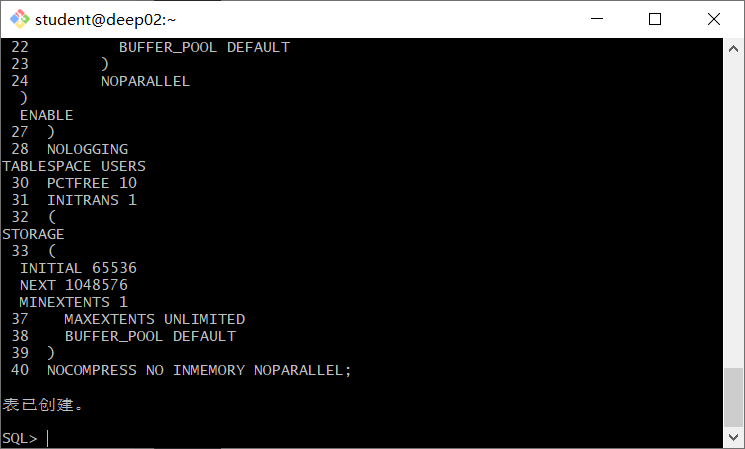

# 实验四: 对象管理
## 实验目的: 
了解Oracle表和视图的概念，学习使用SQL语句Create Table创建表，学习Select语句插入，修改，删除以及查询数据，学习使用SQL语句创建视图，学习部分存储过程和触发器的使用。
## 实验场景:
假设有一个生产某个产品的单位，单位接受网上订单进行产品的销售。通过实验模拟这个单位的部分信息：员工表，部门表，订单表，订单详单表。
## 实验内容:
### 创建表:
1.部门表

2.产品表

3.员工表

4.订单表和订单详情表

### 录入数据:
要求至少有1万个订单，每个订单至少有4个详单。至少有两个部门，每个部门至少有1个员工，其中只有一个人没有领导，一个领导至少有一个下属，并且它的下属是另一个人的领导（比如A领导B，B领导C）。
### 序列的应用:
插入ORDERS和ORDER_DETAILS 两个表的数据时，主键ORDERS.ORDER_ID, ORDER_DETAILS.ID的值必须通过序列SEQ_ORDER_ID和SEQ_ORDER_ID取得，不能手工输入一个数字。
### 触发器的应用:
维护ORDER_DETAILS的数据时（insert,delete,update）要同步更新ORDERS表订单应收货款ORDERS.Trade_Receivable的值。
### 查询语句:
1.查询某个员工的信息。
select * from EMPLOYEES where EMPLOYEE_ID=1;

2.递归查询某个员工及其所有下属，子下属员工。
WITH A (EMPLOYEE_ID,NAME,EMAIL,PHONE_NUMBER,HIRE_DATE,SALARY,MANAGER_ID,DEPARTMENT_ID) AS
  (SELECT EMPLOYEE_ID,NAME,EMAIL,PHONE_NUMBER,HIRE_DATE,SALARY,MANAGER_ID,DEPARTMENT_ID
    FROM employees WHERE employee_ID = 11
    UNION ALL
  SELECT B.EMPLOYEE_ID,B.NAME,B.EMAIL,B.PHONE_NUMBER,B.HIRE_DATE,B.SALARY,B.MANAGER_ID,B.DEPARTMENT_ID
    FROM A, employees B WHERE A.EMPLOYEE_ID = B.MANAGER_ID)
SELECT * FROM A;
3.查询订单表，并且包括订单的订单应收货款: Trade_Receivable= sum(订单详单表.ProductNum*订单详单表.ProductPrice)- Discount。

4.查询订单详表，要求显示订单的客户名称和客户电话，产品类型用汉字描述。
select orders.customer_name,orders.customer_tel,product_type from (
select products.product_type,order_id from order_details left join products on order_details.product_name=products.product_name)a
left join orders on orders.order_id=a.order_id

5.查询出所有空订单，即没有订单详单的订单。
select orders.order_id from orders where order_id not in(
select order_id from order_details)

6.查询部门表，同时显示部门的负责人姓名。

7.查询部门表，统计每个部门的销售总金额。
select department_name,count(price) from departments left join(
select employees.department_id,order_id,price from employees left join(
select orders.employee_id, orders.order_id,price from orders left join( 
select order_id, product_num*product_price as price from order_details)a on a.order_id=orders.order_id)b on b.employee_id=employees.employee_id)c on c.department_id=departments.department_id
group by departments.department_name
