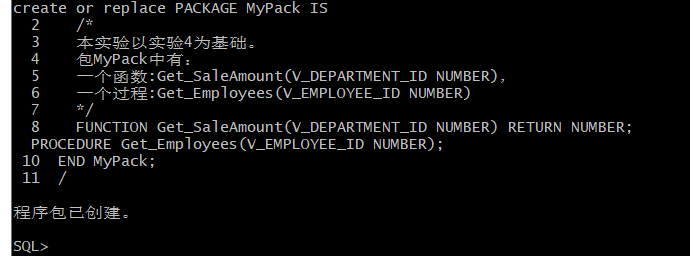
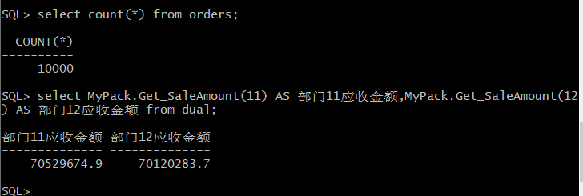
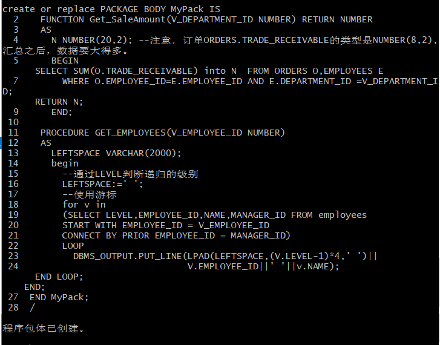
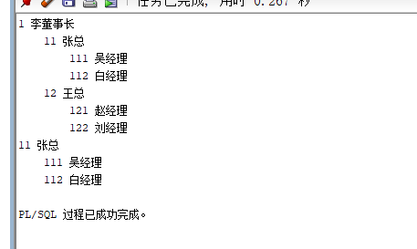

# 实验五 PL/SQL编程
## 实验目的：
    了解PL/SQL语言结构
    了解PL/SQL变量和常量的声明和使用方法
    学习条件语句的使用方法
    学习分支语句的使用方法
    学习循环语句的使用方法
    学习常用的PL/SQL函数
    学习包，过程，函数的用法。

##  实验场景：
- 假设有一个生产某个产品的单位，单位接受网上订单进行产品的销售。通过实验模拟这个单位的部分信息：员工表，部门表，订单表，订单详单表。
- 本实验以实验四为基础

## 实验内容:
1.创建一个包(Package)，包名是MyPack。

2.在MyPack中创建一个函数SaleAmount ，查询部门表，统计每个部门的销售总金额，每个部门的销售额是由该部门的员工(ORDERS.EMPLOYEE_ID)完成的销售额之和。函数SaleAmount要求输入的参数是部门号，输出部门的销售金额。
①函数Get_SaleAmount()测试：
select count(*) from orders;
select MyPack.Get_SaleAmount(11) AS 部门11应收金额,MyPack.Get_SaleAmount(12) AS 部门12应收金额 from dual;

3.在MyPack中创建一个过程，在过程中使用游标，递归查询某个员工及其所有下属，子下属员工。过程的输入参数是员工号，输出员工的ID,姓名，销售总金额。信息用dbms_output包中的put或者put_line函数。输出的员工信息用左添加空格的多少表示员工的层次（LEVEL）。

②过程Get_Employees()测试:
set serveroutput on
DECLARE
  V_EMPLOYEE_ID NUMBER;    
BEGIN
  V_EMPLOYEE_ID := 1;
  MYPACK.Get_Employees (  V_EMPLOYEE_ID => V_EMPLOYEE_ID) ;  
  V_EMPLOYEE_ID := 11;
  MYPACK.Get_Employees (  V_EMPLOYEE_ID => V_EMPLOYEE_ID) ;    
END;
/

4.由于订单只是按日期分区的，上述统计是全表搜索，因此统计速度会比较慢，如何提高统计的速度呢？

1）可以扩大数据表空间。
2）可以给用户增大临时空间。
3）尽量避免全表查询，可以考虑创建索引进行查询。

## 实验总结
通过这次实验让我再次熟悉了条件语句，分支语句，循环语句的使用方法，巩固了相关SQL查询知识点，这次实验让我新学会了包和函数的创建方法，以及如何使用游标，虽然以前接触过游标这个知识，但是由于当时没重视已经忘完了，通过这次实验终于基本明白了游标的使用方法，包和函数的创建方法也能够基本明白其原理，受益匪浅
