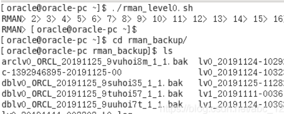
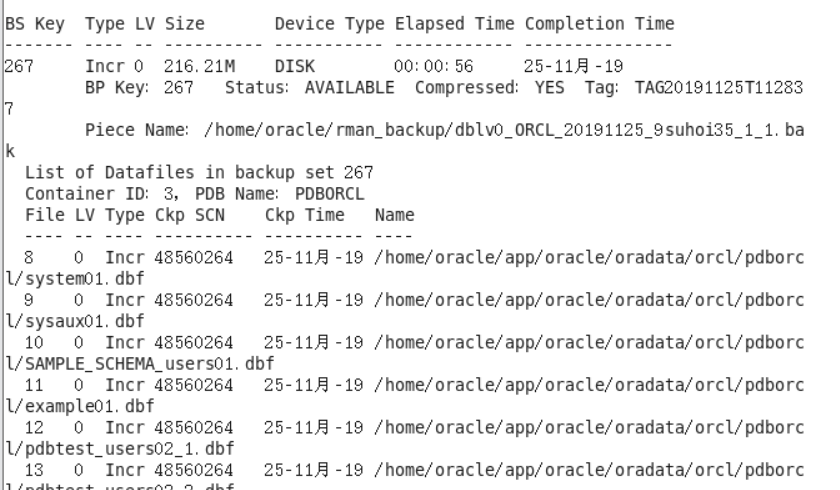
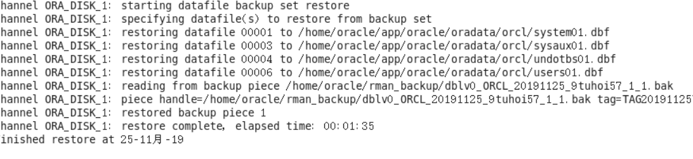

# 实验六 基于Oracle的图书管理系统数据库设计

## 实验内容:

### 1.创建表空间

create TABLESPACE library
datafile 'f:\oracle\book' size 50m
autoextend on next 50m maxsize 100m;

create TABLESPACE library2
datafile 'f:\oracle\book2' size 50m
autoextend on next 50m maxsize 100m;

### 2.创建用户
create user book IDENTIFIED by book
DEFAULT TABLESPACE library;

create user books IDENTIFIED by book2
DEFAULT TABLESPACE library;

### 3.授权用户
grant all PRIVILEGES to book;
grant all PRIVILEGES to books;

### 4.创建管理员角色和读者角色

create role manager identified by manager;
create role reader IDENTIFIED by reader;

#### 4.1给普通读者用户只授权查询操作
grant select on book to reader;

#### 4.2授权管理员角色可进行各种操作
grant connect,resource to manager;

grant create any sequence to manager;  

grant create any table to manager;  

grant delete any table to manager;  

grant insert any table to manager; 

grant select any table to manager;

grant create any view to manager;

grant update any table to manager;  

grant execute any procedure to manager;  

### 5.创建读者表

create table reader(
rno number(10) not null primary key,
rname varchar2(20), 
rid number(18) unique)tablespace library
storage(initial 256k);

### 6.创建图书表

create table books(
bno number(10) not null primary key,
bname varchar2(20) not null,
bprice varchar(4),
author varchar2(30) not null,
bnum int not null)
tablespace library
storage(initial 256k);

### 7.创建图书类别表

create table book_style(
bookstyleno varchar(30) primary key,
bookstyle varchar(30));

### 8.创建借阅表

create table rb(
readno number(10) not null primary key,
rno number(10) not null,
rname varchar2(20),
bno number(18) not null,
bname varchar2(20),
regdate date default sysdate,
back char(2))tablespace library
storage(initial 256k);

<!-- 为借阅表创建外键约束 -->
alter table rb add constraint fk_rb foreign key
(rno) references
reader(rno);
### 9.创建管理员表
create table manager(
mno number(10) not null primary key,
mname varchar2(20)not null,
regdate date default sysdate
)tablespace library
storage(initial 256k);

### 10.向表插入5万条数据
#### 10.1 创建索引
create sequence seq_newUserid increment by 1 start with 1 maxvalue 999999999;

#### 10.2 对每个表开始插入数据

由于管理员人数又要求，所以向管理员表中只插入两条数据

insert into manager(mno,mname) values(1,'沐沐');

insert into manager(mno,mname) values(2,'勇勇');
#### 向读者表插入
create or replace
PROCEDURE insertdata as
flag number;
begin
    flag:=0;
    for i in 1..10000
        loop
            insert into reader(rno,rname,rid)
            values(seq_newUserid.nextval,'海洋一',flag);
            flag:=flag+1;
            if flag=10001 then 
                commit;
            end if;
        end loop;
end;

#### 向书籍表插入
create or replace
PROCEDURE insertdata1 as
flag number;
begin
    flag:=0;
    for i in 1..10000
        loop
            insert into books(bno,bname,bprice,author,bnum)
            values(seq_newUserid.nextval,'会计基础',50,'辰东',1);
            flag:=flag+1;
            if flag=10001 then 
                commit;
            end if;
        end loop;
end;

#### 向书籍类型表插入
create or replace
PROCEDURE insertdata2 as
flag number;
begin
    flag:=0;
    for i in 1..10000
        loop
INSERT INTO BOOK_STYLE (bookstyleno,bookstyle)
VALUES (seq_newUserid.nextval,'人文艺术类');
            flag:=flag+1;
            if flag=10001 then 
                commit;
            end if;
        end loop;
end;

#### 向借阅表插入
create or replace
PROCEDURE insertdata3 as
flag number;
begin
    flag:=0;
    for i in 1..10000
        loop
insert into rb(readno,rno,rname,bno,bname,BACK)
values(seq_newUserid.nextval,103,'海洋一',1010,'遮天10','N');
            flag:=flag+1;
            if flag=10001 then 
                commit;
            end if;
        end loop;
end;

create or replace
PROCEDURE insertdata4 as
flag number;
begin
    flag:=0;
    for i in 1..10000
        loop
insert into rb(readno,rno,rname,bno,bname,BACK)
values(seq_newUserid.nextval,105,'马六',1015,'斗罗大陆','N');
            flag:=flag+1;
            if flag=10001 then 
                commit;
            end if;
        end loop;
end;

#### 执行
call insertdata4();

call insertdata3();

call insertdata2();

call insertdata1();

call insertdata();

### 11. 创建主键索引

create unique index manager_index on manager (mno desc) 
tablespace library
storage 
( 
  buffer_pool default 
);

create unique index book_index on books (bno desc) 
tablespace library
storage 
( 
  buffer_pool default 
);

create unique index read_index on rb (readno desc) 
tablespace library 
storage 
( 
  buffer_pool default 
);

create unique index reader_index on reader (rno desc) 
tablespace library
storage 
( 
  buffer_pool default 
);
### 12.创建视图

create or replace view book_view_union as
select bno,bname,bprice,bnum from books;

create or replace view reader_view_union as
select rno,rname,rid from reader;

create or replace view rb_view_union as
select readno,rno,rname,bno,bname,regdate,back from rb;

### 13.创建程序包及函数,函数的调用

CREATE OR REPLACE PACKAGE  DEMO_PKG
IS
  DEPTREC READER%ROWTYPE;
  
  
  FUNCTION add_reader(
           rno    NUMBER, 
           rname VARCHAR2, 
           rid  NUMBER)
  RETURN NUMBER;
  
  --delete dept...
  FUNCTION delete_reader(rno NUMBER)
  RETURN NUMBER;
  
  --query dept...
  PROCEDURE query_reader(rno IN NUMBER);
END DEMO_PKG;

--还书数据的修改管理

CREATE OR REPLACE PROCEDURE RBack(B_ID VARCHAR2)
IS
BEGIN
UPDATE RB SET BACK = 'Y' WHERE readno = B_ID;
COMMIT;
END;
--执行
BEGIN
rback('1');
END;

--创建函数统计各种图书的库存量

CREATE OR REPLACE FUNCTION GETSCOUNT(au IN VARCHAR2) RETURN NUMBER
AS
BOOKNUM NUMBER;
BEGIN
SELECT bnum INTO BOOKNUM FROM BOOKS WHERE author = au;
RETURN(BOOKNUM);
END;

--调用函数

DECLARE
COUNTNUM NUMBER:=0;
BEGIN
COUNTNUM:=GETSCOUNT('斗罗大陆');
SYS.DBMS_OUTPUT.PUT('图书馆有“斗罗大陆”所写书籍总数为: ');
SYS.DBMS_OUTPUT.PUT(COUNTNUM);
SYS.DBMS_OUTPUT.PUT_LINE('本');
END;

### 14. 触发器
CREATE OR REPLACE TRIGGER tri_rb
AFTER INSERT OR UPDATE ON RB
FOR EACH ROW
DECLARE
BEGIN
SYS.DBMS_OUTPUT.PUT_LINE('借阅者：'||:NEW.RNAME);
SYS.DBMS_OUTPUT.PUT_LINE('书籍编号：'||:NEW.BNO);
SYS.DBMS_OUTPUT.PUT_LINE('书籍名称：'||:NEW.BNAME);
SYS.DBMS_OUTPUT.PUT_LINE('借出日期：'||:NEW.REGDATE);
SYS.DBMS_OUTPUT.PUT_LINE('是否归还：'||:NEW.BACK);
SYS.DBMS_OUTPUT.PUT_LINE('触发器已被执行');
END;
### 15.备份
cat rman_level0.sh
./rman_level0.sh

#### 15.1 查看备份内容
rman  target

